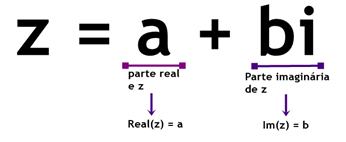
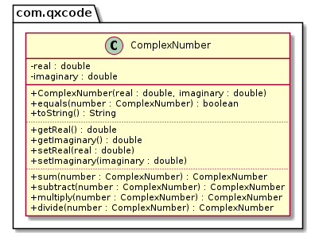

# Números Complexos




Os números complexos são números compostos por uma **parte real** e **uma parte imaginária**. Eles representam o conjunto de todos os pares ordenados (x, y), cujos elementos pertencem ao conjunto dos números reais (`ℝ`).

A forma mais usual de representar números complexos é utilizando a forma algébrica. A forma algébrica, de um número complexo `z` é:

`z = a + bi`

onde:

- x é um número real indicado por: `x = Re(z)`, sendo a parte real de z.
- y é um número real indicado por: `y = Im(z)`, sendo a parte imaginária de z.

**Sua tarefa nesta atividade é:** Escrever em Java a classe *NumeroComplexo* que represente um número complexo. Seu sistema deve ter pelo menos duas classes, a classe *NumeroComplexo* e a classe *Manual*

***

## Requisitos
A classe deverá ter os seguintes métodos:

- **construtor**: que recebe dois valores de ponto flutuante como argumentos para inicializar os campos da classe (parte real e imaginária)

- **toString**: que deve retornar uma String contendo o número complexo encapsulado usando a notação `a + bi` onde `a` é a parte real e `b` a imaginária.

- **equals**: que recebe outra instância da classe **NumeroComplexo** e retorna *true* se os valores dos campos encapsulados forem iguais aos da instância passada como argumento.

- **sum**: que recebe outra instância da classe **NumeroComplexo** e soma este número complexo com o encapsulado usando a fórmula:
    - `(a + bi) + (c + di) = (a + c) + (b + d)i`

- **subtract**: que recebe outra instância da classe **NumeroComplexo** e subtrai o argumento do número complexo encapsulado usando a fórmula:
    - `(a + bi) − (c + di) = (a − c) + (b − d)i`

- **multiply**: que recebe outra instância da classe **NumeroComplexo** e multiplica este número complexo com o encapsulado usando a fórmula:
    - `(a + bi) ∗ (c + di) = (ac − bd) + (ad + bc)i`

- **divide**: que recebe outra instância da classe **NumeroComplexo** e divide o número encapsulado pelo passado como argumento usando a fórmula:

    - 

<!-- \frac{a+bi}{c+di}=\frac{ac+bd}{c^{2}+d^{2}}+\frac{bc-ad}{c^2+d^2}i -->

***

## Diagrama



***
## Esqueleto

<!--FILTER Solver.java java-->
```java
public class Manual {
    public static void main(String[] args) throws Exception {
        Locale.setDefault(Locale.US);

        // cria três objetos da classe ComplexNumber p1, p2 e p3
        ComplexNumber p1 = new ComplexNumber(1, 2);
        ComplexNumber p2 = new ComplexNumber(3, 4);
        ComplexNumber p3 = new ComplexNumber(5.3, 7.8);

        // cria uma referência para apontar os resultados das operações
        ComplexNumber resultado;
        
        // imprime: (1.00 + 2.00i) + (3.00 + 4.00i) = (4.00 + 6.00i)
        resultado = p1.sum(p2);
        System.out.printf("%s + %s = %s%n", p1, p2, resultado);

        // imprime: (5.30 + 7.80i) - (5.30 + 7.80i) = (0.00 + 0.00i)
        resultado = p3.subtract(p3);
        System.out.printf("%s - %s = %s%n", p3, p3, resultado);

        // imprime: (5.30 + 7.80i) - (1.00 + 2.00i) = (4.30 + 5.80i)
        resultado = p3.subtract(p1);
        System.out.printf("%s - %s = %s%n", p3, p1, resultado);

        // imprime: (1.00 + 2.00i) * (5.30 + 7.80i) = (-10.30 + 18.40i)
        resultado = p1.multiply(p3);
        System.out.printf("%s * %s = %s%n", p1, p3, resultado);

        // imprime: (3.00 + 4.00i) / (5.30 + 7.80i) = (0.53 + -0.02i)
        resultado = p2.divide(p3);
        System.out.printf("%s / %s = %s%n", p2, p3, resultado);
    }
}
```
<!--FILTER_END-->