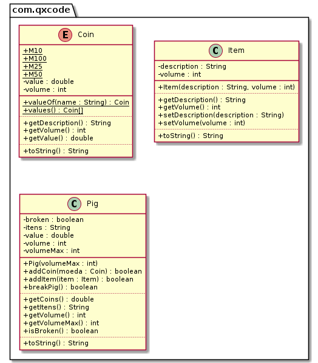

# Porquinho & Utilizando enum para definir as moedas e um bool para controlar o estado do porco


<!--TOC_BEGIN-->
- [Descrição](#descrição)
- [Diagrama](#diagrama)
- [Esqueleto](#esqueleto)
<!--TOC_END-->

## Descrição
O sistema deverá:

- Gerenciar um cofrinho do tipo Porquinho capaz de guardar moedas e itens.
- As moedas devem ser criadas através de uma `enum`.
- Ambos moedas e itens tem um método getVolume() e getDescription().
- O volume do cofre incrementa conforme ele recebe itens e moedas.
- A lógica da utilização do cofre é:
    - Para inserir moedas e itens o cofre deve estar inteiro.
    - Para obter moedas e itens o cofre deve estar quebrado.
    - Ao obter moedas e itens, os atribuitos `valor` e `itens` do porco devem ser zerados.

## Diagrama


## Esqueleto
<!--FILTER Solver.java java-->
```java
enum Coin {
    M10(0.10, 1),
    M25(0.25, 2),
    M50(0.50, 3),
    M100(1.00, 4);

    public double value;
    public int volume;
    private Coin(double value, int volume) {
        this.value = value;
        this.volume = volume;
    }
    public int getVolume() {
        return volume;
    }
    public String getDescription() {
        return "Coin: " + value;
    }
    public String toString() {
        return "Coin: " + value + " Volume: " + value;
    }
}
class Item {
    private String description;
    private int volume;
    public Item(String description, int volume);
    public String getDescription();
    public void setDescription(String description);
    public void setVolume(int volume);
    public int getVolume();
    public String toString();
}
class Pig{
    private String itens = "";
    private double value = 0;
    private int volume = 0;
    private int volumeMax;
    private boolean broken = false;
    //inicializa o volumeMax
    public Pig(int volumeMax);
    //se nao estiver quebrado e couber, adicione o value e o volume
    public boolean addCoin(Coin moeda);
    //se não estiver quebrado e couber, adicione no volume e na descrição
    public boolean addItem(Item item);
    //quebre o pig
    public boolean breakPig();
    //se estiver quebrado, pegue e retorne o value
    public double getCoins();
    //se estiver quebrado, pegue e retorno os itens
    public String getItens();
    public int getVolume();
    public int getVolumeMax();
    public boolean isBroken();
    //mostre o conteúdo do pig
    public String toString();
}
public class Solver{
    public static void main(String[] args) {
        Pig pig = new Pig(20);
        System.out.println(pig); //I:() M:0 V:0/20 EQ:false
        pig.addCoin(Coin.M10);
        pig.addCoin(Coin.M50);
        System.out.println(pig); //I:() M:0.6 V:4/20 EQ:false

        pig.addItem(new Item("ouro", 3));
        System.out.println(pig); //I:(ouro) M:0.6 V:7/20 EQ:false

        pig.addItem(new Item("passaporte", 2));
        System.out.println(pig); //I:(ouro, passaporte) M:0.6 V:9/20 EQ:false

        pig.getItens();  //Voce deve quebrar o cofre primeiro
        pig.getCoins(); //Voce deve quebrar o cofre primeiro
        System.out.println(pig); //I:(ouro, passaporte) M:0.6 V:9/20 EQ:false
        pig.addItem(new Item("travesseiro", 22)); //nao cabe no porco

        pig.breakPig();
        pig.breakPig(); //fail: porco ja esta quebrado

        System.out.println(pig.getItens());  //ouro, passaporte
        System.out.println(pig.getCoins()); //0.6
        System.out.println(pig); //I:() M:0 V:9/20 EQ:true
    }
}
```
<!--FILTER_END-->