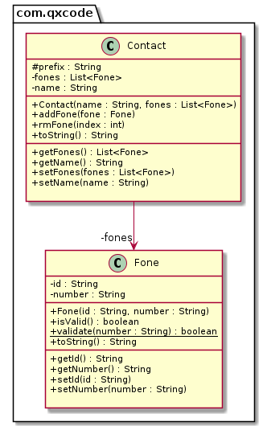

# Contato & Agenda 1: Gerenciando um único contato


<!--TOC_BEGIN-->
- [Requisitos](#requisitos)
- [Shell](#shell)
- [Diagrama UML](#diagrama-uml)
- [Esqueleto](#esqueleto)
<!--TOC_END-->


O objetivo dessa atividade é implementar uma classe responsável por guardar um **único** contato da agenda telefônica do seu celular. Um contato pode ter vários telefones.

## Requisitos
Seu programa deve:

- **Definir nome**
    - Poder inicializar o contato passando o nome.
        - Se já houver contato, inicie um novo contato.
        - Se não houver nome, o nome default é "".
- **Inserir telefones no contato** 
    - Um telefone tem um label e um fone.
    - Labels serão nomes como: casa, fixo, oi.
    - Labels podem ser duplicados.
    - Adapte o print para apresentar os índices.
```sh
# Exemplo de saída
- ana [0:tim:3434] [1:casa:4567] [2:oi:8754] [3:casa:4567] [4:oi:8754]
```

- **Remover telefones do contato.**    
    - Remove os telefones pelo indice.
- **Validando os números de telefone.**
    - Processe os telefones para apenas permitir nos telefones os seguintes caracteres "0123456789()."
    - Se o usuário tentar inserir individualmente um telefone invalido, avise e não insira o telefone.

***
## Shell

```bash
#__case definindo nome
$init david
$show
- david

#__case inserindo telefones
$add oi 88
$add tim 99
$add tim 98
$add vivo 83
$show
- david [0:oi:88] [1:tim:99] [2:tim:98] [3:vivo:83]

#__case removendo telefone por indice
$rm 2
$show
- david [0:oi:88] [1:tim:99] [2:vivo:83]
$rm 0
$show
- david [0:tim:99] [1:vivo:83]

#__case validando numero de fone
$add tim 9a9
fail: invalid number
$add tim (85)99.99
$show
- david [0:tim:99] [1:vivo:83] [2:tim:(85)99.99]
$end
#__end__
```

***
## Diagrama UML



## Esqueleto

<!--FILTER Solver.java java-->
```java
class Fone {
    private String id;
    private String number;
    public Fone(String id, String number);
    //verifica se o número é um número de telefone válido
    public static boolean validate(String number);
    //utiliza o static validate para retornar se essa instancia do fone é valida
    public boolean isValid();
    //O resultado deve ficar assim
    //oi:1234
    public String toString();
    //GETS e SETS
    public String getId();
    public void setId(String id);
    public String getNumber();
    public void setNumber(String number);
}
class Contact {
    private String name;
    private List<Fone> fones;
    protected String prefix = "-"; //utilizado no toString
    //Crie um ArrayList para o ATRIBUTO fones
    //Se a variável fones não for null, adicione todos os fones usando o método addFone
    public Contact(String name, List<Fone> fones);
    //Se fone for válido, insira no atributo fones
    //Se não, informe o erro
    public void addFone(Fone fone);
    //Se o índice existir no ArrayList, remova o telefone com esse índice
    public void rmFone(int index);
    //Use um contador para mostrar o índice do telefone
    //Use o toString do fone para adicioná-lo à saída
    //O resultado dever ficar assim:
    //- david [0:oi:123] [1:tim:9081] [2:claro:5431]
    public String toString();
    //GETS e SETS
    public String getName();
    public void setName(String name);
    public List<Fone> getFones();
    //limpe a lista de fones
    //utilize o addFone para adicionar apenas os fones válidos
    public void setFones(List<Fone> fones);
}
public class Solver {
    public static void main(String[] args) {
        Scanner scanner = new Scanner(System.in);
        Contact contact = new Contact("", null);
        while(true){
            String line = scanner.nextLine();
            System.out.println("$" + line);
            String ui[] = line.split(" ");
            if(ui[0].equals("end")) {
                break;
            } else if(ui[0].equals("init")) { //name
                contact = new Contact(ui[1], null);
            } else if(ui[0].equals("add")) {  //id fone
                contact.addFone(new Fone(ui[1], ui[2]));
            } else if(ui[0].equals("rm")) {   //index
                contact.rmFone(Integer.parseInt(ui[1]));
            } else if(ui[0].equals("show")) {
                System.out.println(contact);
            } else {
                System.out.println("fail: invalid command");
            }
        }
        scanner.close();
    }
}
```
<!--FILTER_END-->
