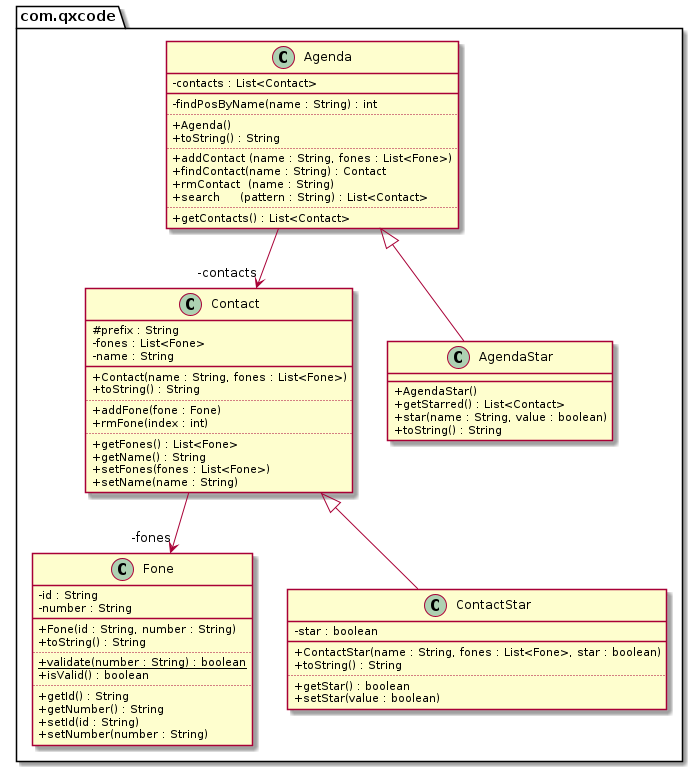

# ContatoStar & Agenda 3 (herança)


<!--TOC_BEGIN-->
- [Requisitos](#requisitos)
- [Shell](#shell)
- [Diagrama UML](#diagrama-uml)
- [Esqueleto](#esqueleto)
<!--TOC_END-->

Ampliando a atividade de Agenda 2, vamos criar uma agenda que gerencia os nossos contatos.

## Requisitos

O sistema deverá:

- Partida
    - Você deve partir do código do projeto Busca e NÃO DEVE MODIFICAR em nada as classes originais.
    - Você deve criar uma classe ContatoStar que herda de contato e adiciona a ação de favoritar.
    - Você deve criar uma classe AgendaStar que herda de agenda e adiciona a ação de favoritar e pegar favoritos.
- Sua AgendaStar deve ser capaz de manipular tanto contatos normais quanto ContactStar, mas só deve ser capaz de favoritar ContactStar

- Mostrando
    - Ordenar os contatos pelo idContato.
    - Se o contato não for favorito (starred) use - antes do idContato.
    - Marque os contatos que são favoritados com um @ antes do idContato. 

- Favoritando
    - Favoritar contatos. (star)
    - Desfavoritar contatos. (unstar)
    - Mostrar apenas os favoritos. (starred)


## Shell

```bash
#__case iniciando agenda
$add eva oi:8585 claro:9999
$add ana tim:3434 
$add ana casa:4567 oi:8754
$add bia vivo:5454
$add rui casa:3233
$add zac fixo:3131

$show
- ana [0:tim:3434] [1:casa:4567] [2:oi:8754]
- bia [0:vivo:5454]
- eva [0:oi:8585] [1:claro:9999]
- rui [0:casa:3233]
- zac [0:fixo:3131]

#__case favoritando
$star eva
$star ana
$star ana
$star zac
$star rex
fail: contato rex nao existe

$show
@ ana [0:tim:3434] [1:casa:4567] [2:oi:8754]
- bia [0:vivo:5454]
@ eva [0:oi:8585] [1:claro:9999]
- rui [0:casa:3233]
@ zac [0:fixo:3131]

#__case lista de favoritos
$starred
@ ana [0:tim:3434] [1:casa:4567] [2:oi:8754]
@ eva [0:oi:8585] [1:claro:9999]
@ zac [0:fixo:3131]

#__case removendo contato
$rmContact zac

$show
@ ana [0:tim:3434] [1:casa:4567] [2:oi:8754]
- bia [0:vivo:5454]
@ eva [0:oi:8585] [1:claro:9999]
- rui [0:casa:3233]

$starred
@ ana [0:tim:3434] [1:casa:4567] [2:oi:8754]
@ eva [0:oi:8585] [1:claro:9999]

#__case desfavoritando
$unstar ana

$starred
@ eva [0:oi:8585] [1:claro:9999]

$show
- ana [0:tim:3434] [1:casa:4567] [2:oi:8754]
- bia [0:vivo:5454]
@ eva [0:oi:8585] [1:claro:9999]
- rui [0:casa:3233]
$end
```


***
## Diagrama UML



## Esqueleto
<!--FILTER Solver.java java-->
```java
class ContactStar extends Contact {
    private boolean star;
    //contrutor default
    public ContactStar(String name, List<Fone> fones, boolean star);
    //muda o prefixo e o valor de star
    void setStar(boolean value);
    boolean getStar(); 
}
class AgendaStar extends Agenda {
    //SE o contato existir e for do tipo ContatoStar altere o atributo star dele
    public void star(String name, boolean value); 
    //filtre em uma nova lista apenas os contatos que forem do tipo ContatoStar e que estão favoritados
    public List<Contact> getStarred();
}
class Solver {
    //cria um ContactStar a partir do vetor de entrada tal como
    //add joao oi:123 tim:432 claro:09123
    static ContactStar parseContact(String[] ui);
    //Lembre de criar uma AgendaStar no lugar de uma agenda normal e adicionar a ela contatos Star
    public static void main(String[] args);
}
```
<!--FILTER_END-->