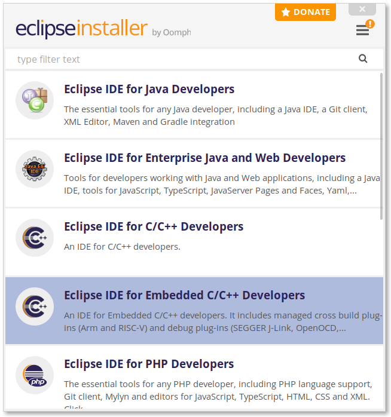
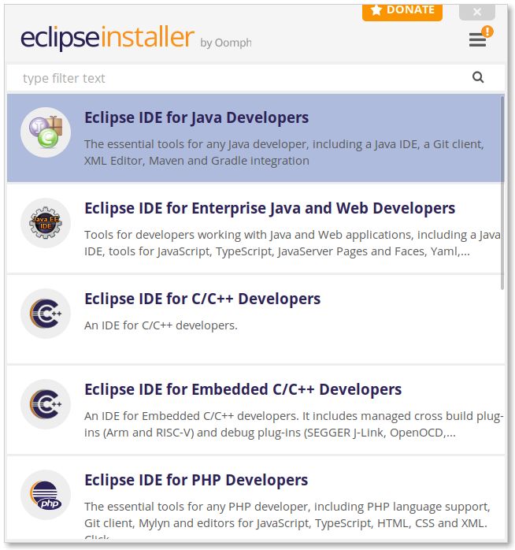
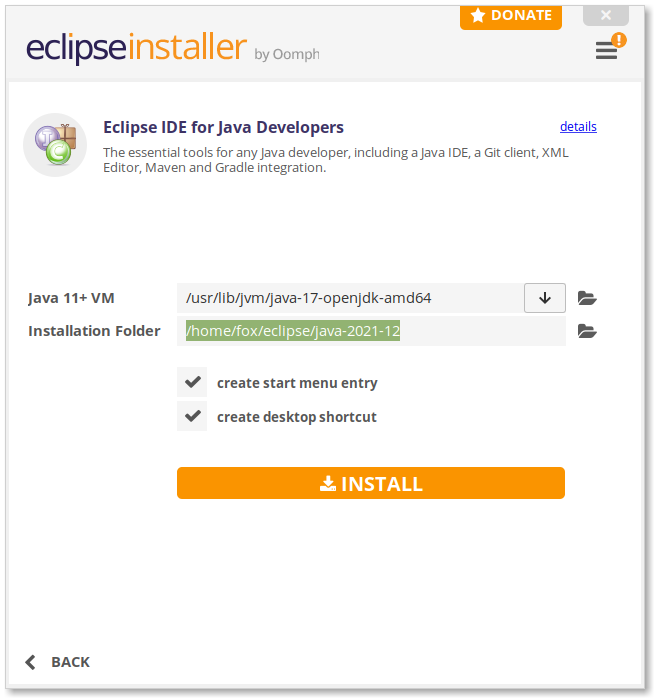
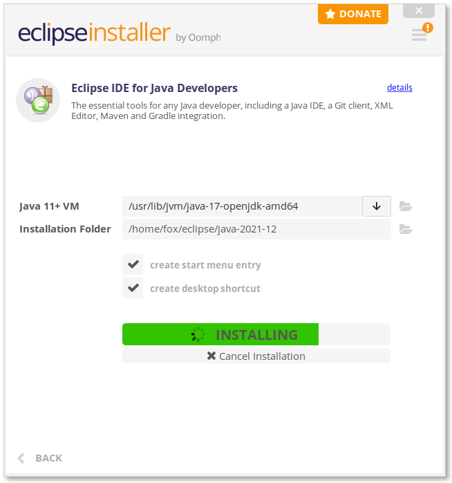
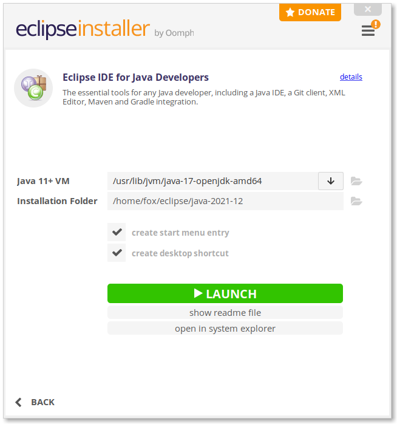
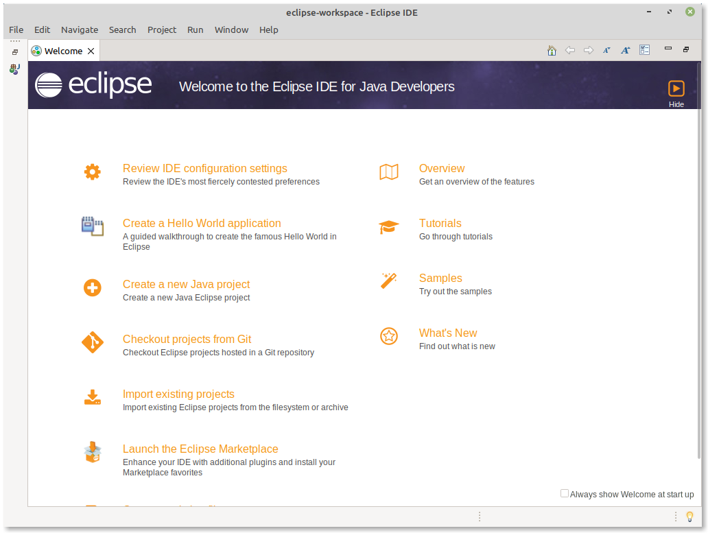
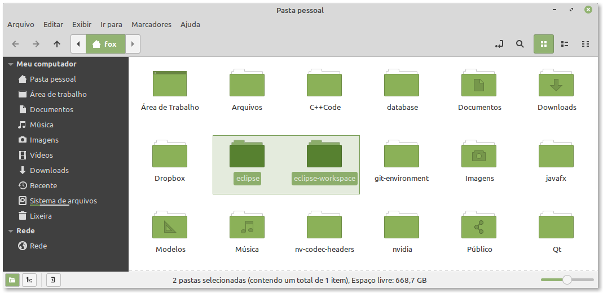

## Como Instalar (Remover) o IDE Eclipse no Linux Ubuntu 20.04 e derivados

Este tutorial mostra como instalar a versão mais recente do IDE Eclipse no Ubuntu Linux.


### 1. Baixe e Inicie o Instalador do Eclipse

Primeiramente, vá para a página oficial de download do Eclipse: https://www.eclipse.org/downloads/


Em seguida, extraia o o arquivo **eclipse-inst-jre-linux64**. Usando o terminal, vá para a pasta que foi extraída e digite o seguinte comando:

```bash
chmod 777 eclipse-inst
```

Agora, execute o arquivo de instalação **eclipse-inst** com o seguinte comando:

```bash
./eclipse-inst
```

A seguinte janela aparecerá:




### 2. Instale o Eclipse

Quando o assistente de instalação abrir, escolha a opção **Eclipse IDE for Java Developers”.



A seguir, clique no botão **INSTALL** e aceite a licença para poder iniciar a instalação.








Pronto! O software encontra-se instalado por padrão na pasta *home* do usuário. Uma vez instalado, você pode iniciá-lo no iniciador de aplicativos do sistema ou no atalho da área de trabalho. A tela inicial do Eclipse pode ser vista abaixo:




## Como Remover o Eclipse Completamente 

O Eclipse é instalado por padrão no diretório *home* do usuário. Basta abrir o gerenciador de arquivos e remover a pasta **eclipse** e a pasta **eclipse-workspace**.



Para livrar-se do atalho na Área de Trabalho basta movê-lo para a Lixeira.

Para livrar-se do atalho no lançador do sistema, pressione *CTRL+ALT+T* para abrir o terminal e execute os seguintes comandos:

- Navegue para o local onde está o atalho:

```bash
cd .local/share/applications/
```

- Remova todos os arquivos relacionados ao Eclipse:

```bash
rm *eclipse*.desktop epp*.desktop
```

