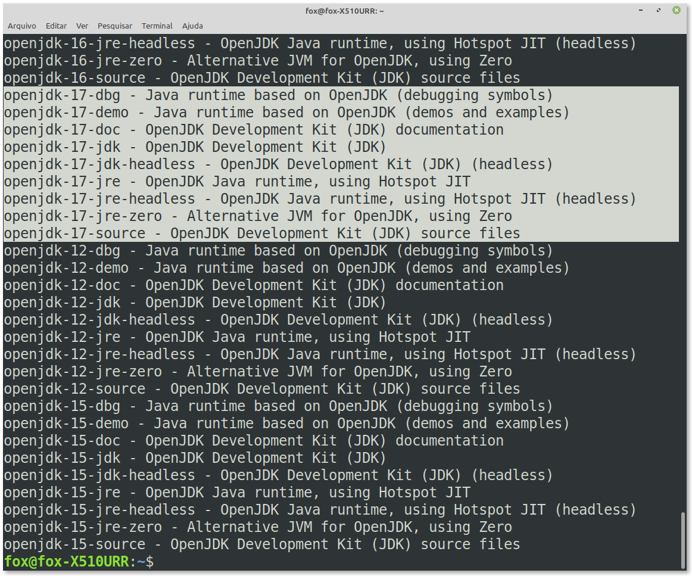
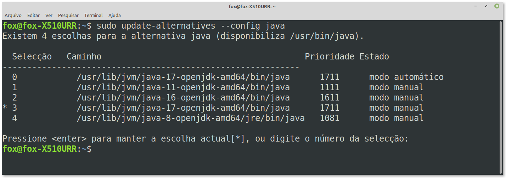
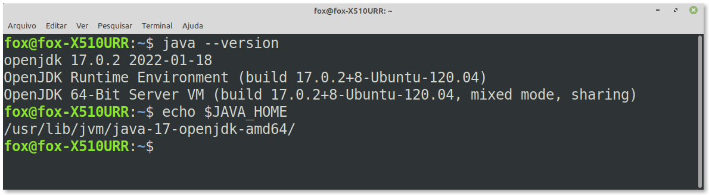
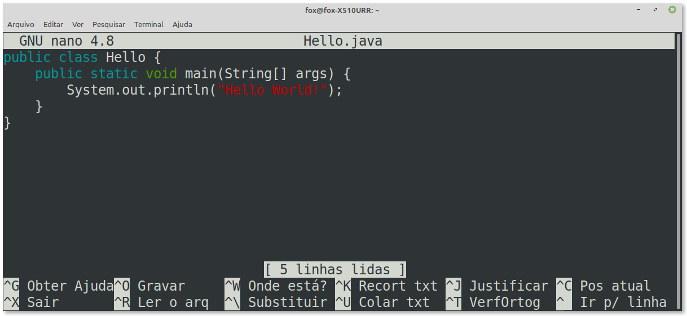
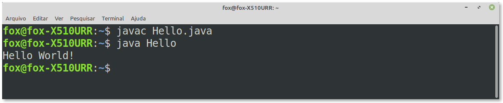
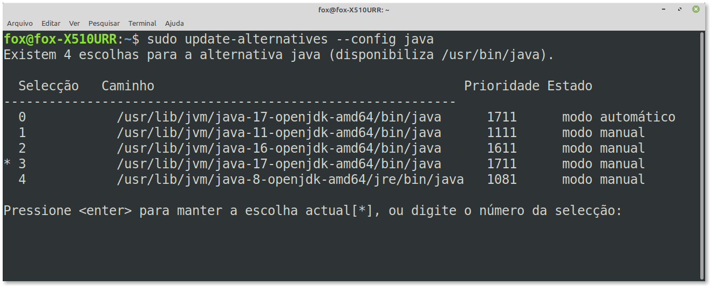

## Instalando OpenJDK 17 no Ubuntu 20.04 e derivados

A seguir, mostro como instalar o Java 17 (OpenJDK 17) no sistema Linux (Ubuntu e derivados). O Java é uma linguagem de programação orientada a objetos de alto nível e uma plataforma de computação destinada a permitir que os desenvolvedores de aplicativos escrevam o programa uma vez e executem em qualquer lugar. Isso significa que um código Java compilado é executado em todas as plataformas que suportam Java sem a necessidade de recompilação. 

O JDK é uma coleção de várias ferramentas de programação, como JRE (Java Runtime Environment), Java, Javac, Jar e muitas outras. O Java 17 LTS é a versão de suporte de longo prazo mais recente para a plataforma Java SE lançada em 14 de setembro de 2021.

### 1. Atualize o sistema operacional

Atualize seu sistema operacional Ubuntu para garantir que todos os pacotes existentes estejam atualizados:

```bash
sudo apt update && sudo apt upgrade -y
```

O tutorial usará o comando `sudo` e supondo que você tenha o status sudo.

### 2. Instale OpenJDK 17 com APT


Vamos instalar o OpenJDK usando o repositório padrão do Ubuntu 20.04. Primeiro, pesquise para encontrar o que está disponível. No seu terminal, use o seguinte comando:

```bash
apt-cache search openjdk
```

Exemplo de saída:




Como a saída acima indica, OpenJDK 17 JDE e JRE estão disponíveis para instalação.

Para iniciar a instalação dos dois, use o seguinte comando de terminal.

```bash
sudo apt-get install openjdk-17-jdk
```

Confirme a instalação executando o seguinte comando:

```bash
java --version
```

Exemplo de saída:


### 3. Configurando a variável de ambiente

A variável de ambiente `JAVA_HOME` é usada por algumas aplicações a fim de determinar o local em que a instalação do Java foi feita.

Para definir a variável ​​de ambiente `JAVA_HOME`, primeiro você precisa encontrar o caminho da instalação usando o comando `update-alternatives`, assim:

```bash
sudo update-alternatives --config java
```

Exemplo de execução desse comando na minha máquina:



Como visto acima, o caminho de instalação do JAVA 17 na minha máquina ficou assim:

```bash
/usr/lib/jvm/java-17-openjdk-amd64/bin/java
```

Depois de encontrar o caminho da sua instalação Java preferida, abra o arquivo `/etc/environment`:

```bash
sudo nano /etc/environment
```

Assumindo que você quer configurar a variável `JAVA_HOME` para apontar para o OpenJDK 17, adicione a seguinte linha ao final do arquivo:

```bash
JAVA_HOME="/usr/lib/jvm/java-17-openjdk-amd64"
```

Para que as mudanças surtam efeito você pode executar o seguinte comando:

```bash
source /etc/environment
```

Para confirmar a instalação, execute os seguintes comandos:

```bash
java --version
echo $JAVA_HOME
```

Se tiver sido instalado corretamente, você deve ver a seguinte saída:



Na saída acima podemos ver que foi instalada a versão mais recente do OpenJDK 17. Lembre-se, você deve verificar e refazer o processo para atualizações futuras.


### 4. Testando o Java -- Criando uma aplicação

É sempre útil testar instalações desse tipo para confirmar que tudo está funcionando corretamente após a instalação. A maneira mais fácil é criar um pequeno teste usando o famoso exemplo Hello World.

Primeiro, crie o arquivo de programa Java da seguinte maneira:

```bash
sudo nano Hello.java
```

A seguir, adicione o seguinte código Java ao arquivo:

<!--FILTER Solver.java java-->
```java
public class Hello {
    public static void main(String[] args) {
        System.out.println("Hello World!");
    }
}
```
<!--FILTER_END-->

Exemplo de tela:




Salve o arquivo **(CTRL+O)** e então saia do programa **(CTRL+X)**.

A seguir, compile o código usando o seguinte comando:

```bash
javac Hello.java
```

Finalmente, execute o código Java com o seguinte comando:

```bash
java Hello
```

Exemplo de saída:



Parabéns! Tudo está funcionando corretamente.


## Removendo o OpenJDK 17 do seu sistema

As atualizações do JDK são tratadas com os comandos **update** e **upgrade** do **apt**. No entanto, você pode removê-lo separadamente ou completamente se não precisar mais do JDK.

Exemplo de comando para remoção do JDK: 

```
sudo apt-get remove openjdk-17-jdk --purge
```

**Atenção:** O comando acima removerá quaisquer dependências restantes e tentará remover o máximo possível de dados referentes à instalação.


## Configurando a versão default

Se você tiver várias versões do Java instaladas no seu sistema Linux, você pode verificar qual versão está definida como padrão digitando:

```bash
java --version
```

Para mudar a versão default, use o comando `update-alternatives` como a seguir:

```bash
sudo update-alternatives --config java
```

A saída deve ser parecida com a mostrada abaixo:



A tela acima mostra uma lista de todas as versões Java instaladas. Digite o número da versão que deseja usar como padrão e pressione **Enter**.