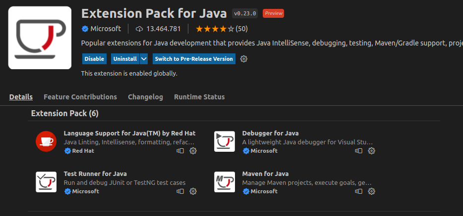
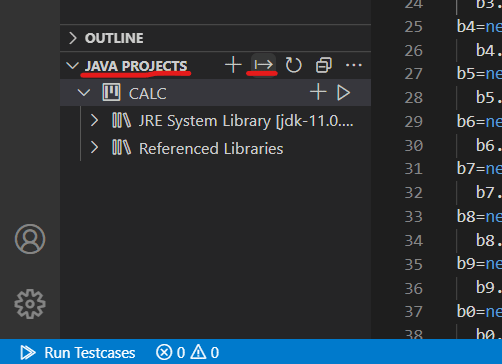
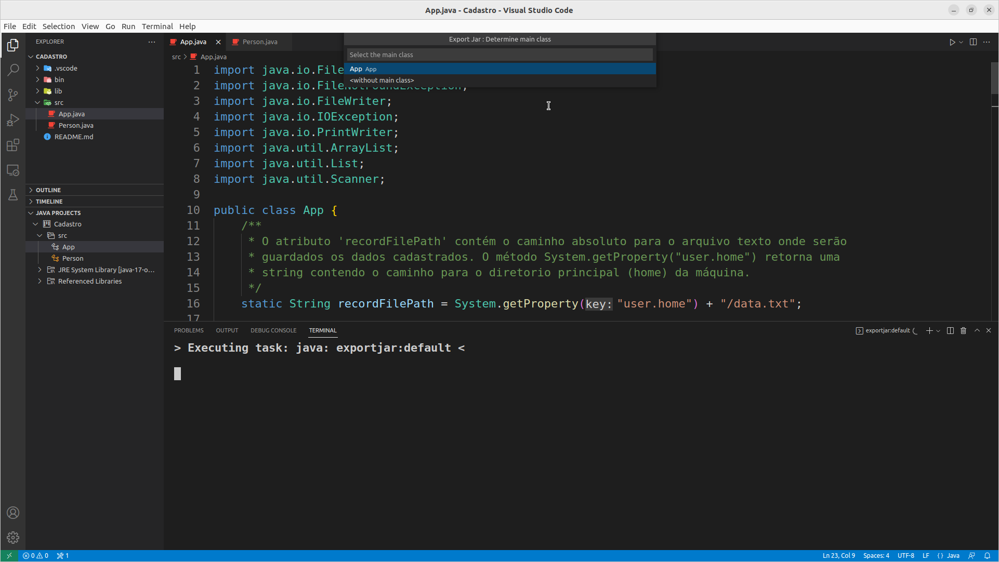
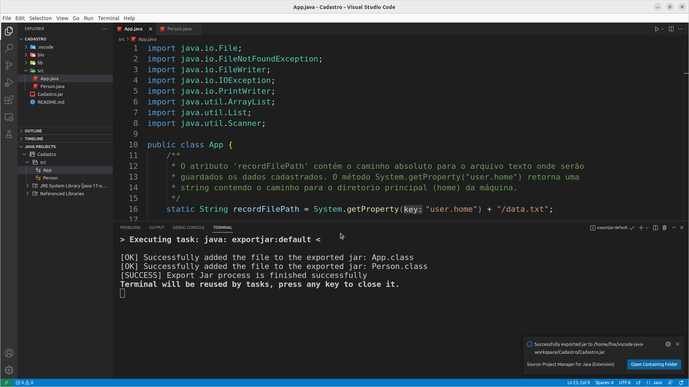
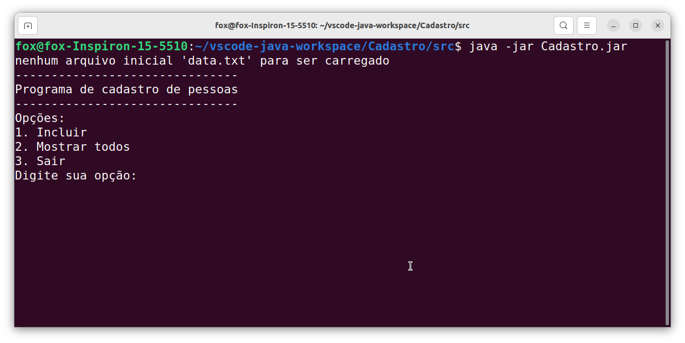
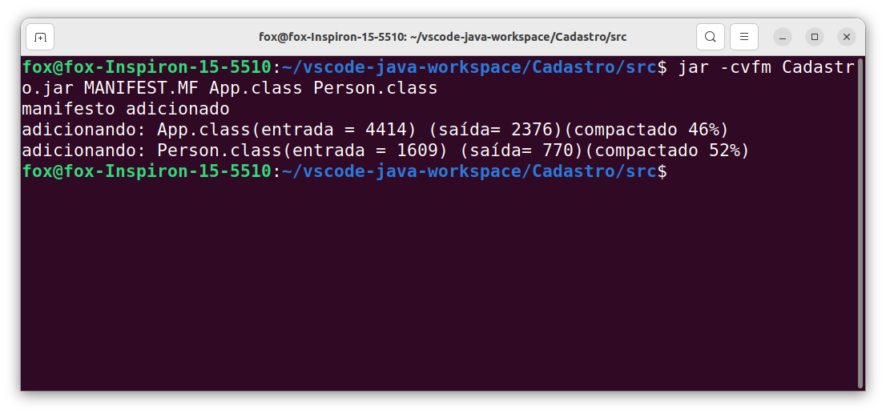

# Criando um arquivo JAR executável no VS Code e pela linha de comando

## 1. O que é a ferramenta JAR do Java?

O **Jar *(Java Archive)*** é uma ferramenta do JDK usada para empacotar um ou mais arquivos *.class* do Java juntamente com metadados associados e outros recursos (texto, imagens, etc.) em um único arquivo a fim de distribuir softwares ou bibliotecas na palataforma Java. O Jar também fornece a facilidade de criar um arquivo com extensão .jar executável que chama o método main da classe principal se você clicar duas vezes no arquivo (no caso de aplicações gráficas).

Um arquivo com a extensão .jar é usado para armazenar programas e jogos Java em um único arquivo. Os arquivos .jar são compactados em ZIP e como eles podem conter centenas ou até milhares de arquivos em formato compactado, é fácil compartilhá-los e movê-los.

Você pode ler a documentação da Oracle sobre o JAR na íntegra aqui nesse link: https://docs.oracle.com/javase/tutorial/deployment/jar/index.html

---

## 2. Como abrir arquivos com extensão .JAR?

O Java Runtime Environment (JRE) deve estar instalado na sua máquina para abrir arquivos JAR executáveis, mas observe que nem todos os arquivos JAR são executáveis. Depois de instalado, você pode apenas clicar duas vezes no arquivo para abri-lo.

Como os arquivos JAR são compactados com ZIP, qualquer descompactador de arquivo pode abrir um para ver o conteúdo que está dentro. Isso inclui programas como 7-Zip, PeaZip e jZip.

Outra forma de abrir o arquivo é usar o seguinte comando no prompt de comando (terminal), substituindo *yourfile.jar* pelo nome do seu próprio arquivo JAR:

`java -jar yourfile.jar`

---

## 3. Neste tutorial

Neste tutorial você aprenderá como criar um arquivo .jar executável. Vamos pegar uma aplicação java para console e explorar duas formas de transformá-la em um arquivo .jar: vamos fazer isso usando o VS Code e depois vamos fazer isso usando a linha de comando.

---

## 4. Gerando JAR a partir do Visual Studio Code

### 4.1. Baixe a extensão

A fim de criar um arquivo .jar executável da sua aplicação, você deve ter a extensão [Extension Pack for Java](https://marketplace.visualstudio.com/items?itemName=vscjava.vscode-java-pack) instalada no seu VS Code.



### 4.2. Escreva o seu programa Java

Eu vou usar nesse exemplo um pequeno projeto Java, chamado **Cadastro**, que eu desenvolvi no VS Code, disponível [aqui](Cadastro).
É um programa Java para console que cadastra pessoas e mostra as pessoas cadastradas no terminal. Além disso, o programa usa persitência em arquivo texto a fim de manter os dados das pessoas cadastradas salvos em arquivo.

### 4.3 Exportando o arquivo JAR

A seguir, mostramos como empacotar a sua aplicação em um arquivo .jar usando o VS Code.

No canto inferior esquerdo do VS Code vocês encontrará a opção `JAVA PROJECTS`. Ao lado dela, você encontrará um símbolo contendo uma flecha para a direita de nome `EXPORT JAR`. Clique nele.



Nesse momento, o VS Code te pedirá para especificar a classe principal `MAIN CLASS`.

Nesse exemplo, forneça a classe Principal `App`.

**Nota:** Se você não especificar a classe principal, o arquivo jar não se tornará um arquivo executável.





Pronto! O seu arquivo .jar executável já foi gerado, com o nome **Cadastro.jar**


---

## 5. Executando o jar

Agora, podemos usar a opção `-jar` do comando `java` para executar nosso aplicativo desde que o arquivo jar executável tenha sido criado.

```
java -jar Cadastro.jar
```

Assim, nossa aplicação será executada, como ilustrado abaixo:



---

## 6. Gerando JAR a partir da Linha de Comando

Neste caso, vamos usar o programa **jar** que vem com o JDK. O programa **jar** possui algumas opções, com as quais podemos criar um arquivo jar executável. Algumas delas estão listadas abaixo:

- **c** cria um novo ficheiro jar e adiciona arquivos nele.
- **v** gera saída detalhada. Ele exibe no terminal os recursos incluídos ou excluídos.
- **m** adiciona um *manifesto* ao ficheiro JAR. Um *manifesto* é uma descrição dos conteúdos do ficheiro. Todo ficheiro tem um manifesto default.
- **f** especifica o nome do arquivo JAR como o segundo argumento da linha de comando.
- **x** extrai arquivos do ficheiro JAR.

Eu vou usar nesse exemplo o mesmo projeto Java, chamado **Cadastro**, usado no item anterior, disponível [aqui](Cadastro). É um programa Java para console que cadastra pessoas e mostra as pessoas cadastradas no terminal. Além disso, o programa usa persitência em arquivo texto a fim de manter os dados das pessoas cadastradas salvos em arquivo.

### 6.1 Compile o projeto

Você pode compilar o seu projeto usando a linha de comando:

`javac App.java Person.java`

A seguir, vamos empacotar os arquivos .class gerados em um arquivo .jar

### 6.2 Criando um arquivo manifesto

- Um arquivo de manifesto é essencial, pois define um ponto de entrada para nosso aplicativo, qual classe principal vamos executar para o arquivo jar.
- O arquivo de manifesto é chamado *MANIFEST.MF* e deve estar localizado no subdiretório chamado *META-INF* do arquivo .jar
- Portanto, crie um arquivo de manifesto chamado MANIFEST.MF no mesmo diretório em que os arquivos *App.class* e *Person.class*, para que não seja necessário definir o caminho da classe explicitamente
- Você deve colocar o seguinte conteúdo dentro do arquivo *MANNIFEST.MF*: Escreva `Main-Class: App` e então pressione ENTER

```
Main-Class: App

```

- Agora, salve o arquivo *MANNIFEST.MF* 

### 6.3 Criando o arquivo jar executável

Um arquivo jar executável pode ser gerado pela linha de comando, seguindo o padrão abaixo:

```
jar -cvfm <jarfilename.jar> <manifestfile> <classname.class>
```

**A ordem dos comandos não deve ser modificada**
1. `jar` é comando para criar o arquivo jar
2. a opção `c` é usada para indicar que estamos criando um arquivo
3. a opção `v` gera uma saída detalhada
4. a opção `f` especifica o nome do arquivo JAR como o segundo argumento da linha de comando
5. a opção `m` adiciona um *manifesto* ao arquivo JAR

Deste modo, os nomes dos arquivos correspondentes também são escritos na mesma ordem e, se houver vários arquivos com extensão .class, inclua-os também.

**Exemplo:**

Abra o terminal ou propt de comando no mesmo diretório em que os arquivos .class e o MANNIFEST.MF estão, e digite o comando abaixo:

```
jar -cvfm Cadastro.jar MANNIFEST.MF App.class Person.class
```



