# Configurando o JavaFX 18 no Eclipse

## 01. Instalação do Scene Builder

A Oracle disponibiliza o código fonte do Scene Builder. Os builds para instalação são mantidos pela Gluon.

Download no link: https://gluonhq.com/products/scene-builder/

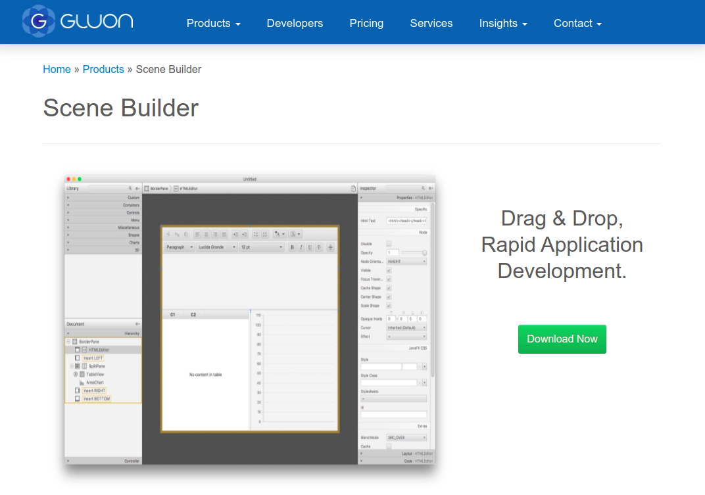

Após baixar o arquivo de instalação do SceneBuilder, descompacte o arquivo e instale o software. Anote o caminho completo da pasta em que o arquivo executável foi instalado, pois esse caminho será necessário mais a frente para a configuração do JavaFX no Eclipse. Uma figura da janela do SceneBuilder é exibida abaixo.

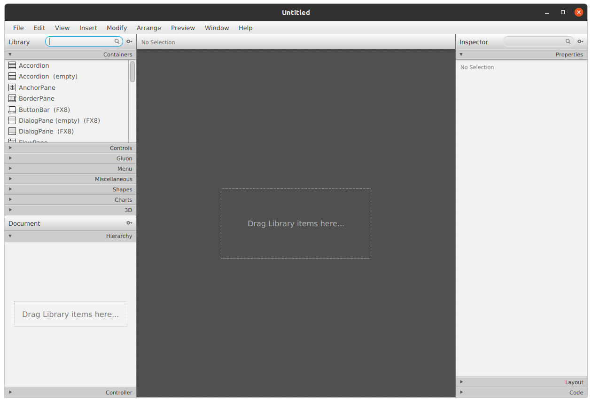

No Ubuntu, para descobrir o diretório em que o SceneBuilder foi instalado, diga os seguintes passos:

1. Inicie o Scene Builder
2. Mostre o caminho para o executável rodando o seguinte comando no terminal: 
    - `ps aux | grep Scene`

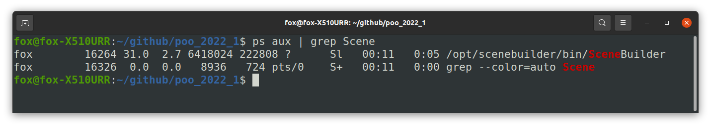

Como indica a primeira linha da saída na figura acima, o caminho para o executável do SceneBuilder no meu sistema é: `opt/scenebuilder/bin/SceneBuilder`

---

## 02. Preparação do Eclipse

- **Atenção:** Baixe e instale a versão mais recente do Eclipse. No momento da escrita deste guia, a versão mais recente é a 2022-03 (4.23.0)
 - Download: https://www.eclipse.org/downloads/


### Baixe o JavaFX SDK 18

- Baixar biblioteca do JavaFX 18 em [gluonhq](https://gluonhq.com/products/javafx/).
- Baixe o arquivo **JavaFX SDK** certo para o seu SO.
    - Na página de downloads é possível selecionar o SO (Linux, Windows), a arquitetura (x64) e o tipo (SDK), como ilustrado na imagem abaixo.

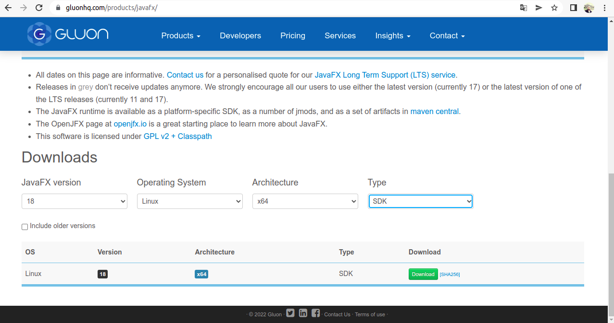

- Após baixar, descompacte em alguma pasta e **anote** o path da pasta **lib**.
- No meu caso, como eu uso Linux, o path para pasta lib ficou como:
- `/home/fox/javafx/openjfx-18_linux-x64_bin-sdk/javafx-sdk-18/lib`

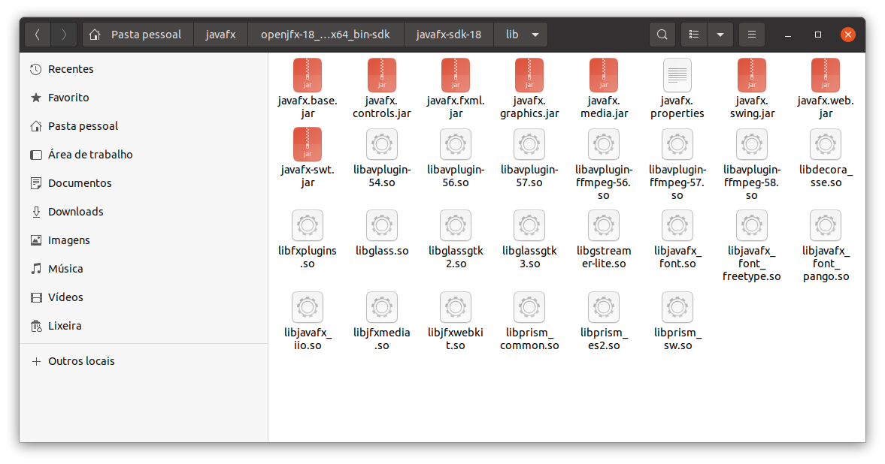


### Instale o plug-in E(fx)clipse no Eclipse

- Com o Eclipse aberto, vá na opção Help -> Eclipse Marketplace -> na caixa de texto `Find` digite o nome do plugin *E(fx)clipse* e tecle ENTER. No momento da escrita desse guia, a versão é a 3.7.0. Instale a versão mais recente disponível. A tela da janela do Eclipse Marketplace é exibida logo abaixo.

- Vai aparecer o plugin. Clique em instalar. Ele vai iniciar a instalação do plugin. Se houver alguma licensa a ser aprovada, aprove e clique `Finish` para finalizar.

- Ele pedirá para reiniciar o Eclipe. Reinicie.

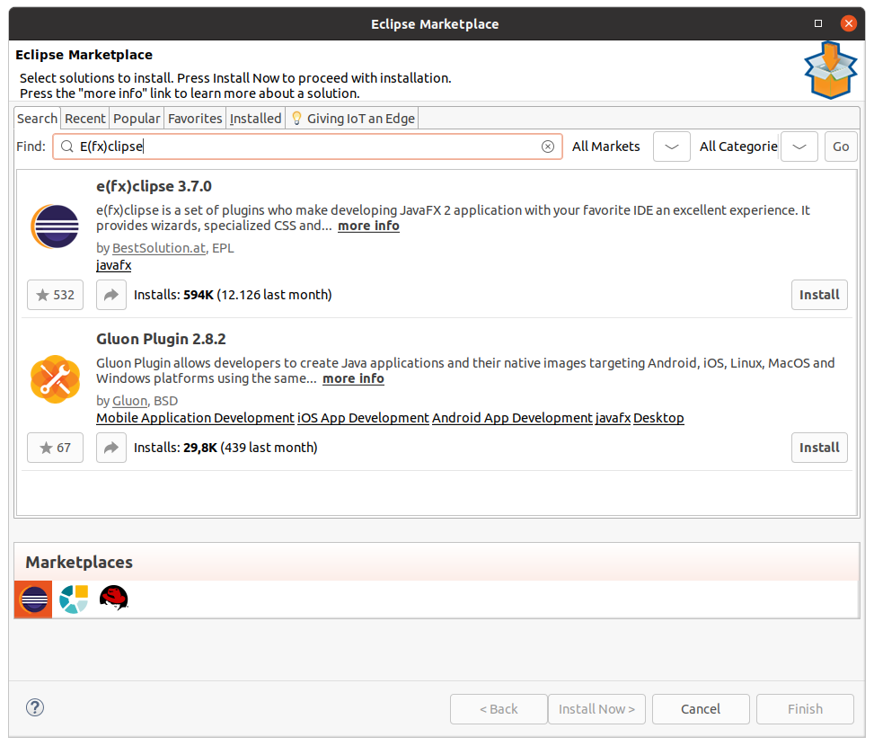

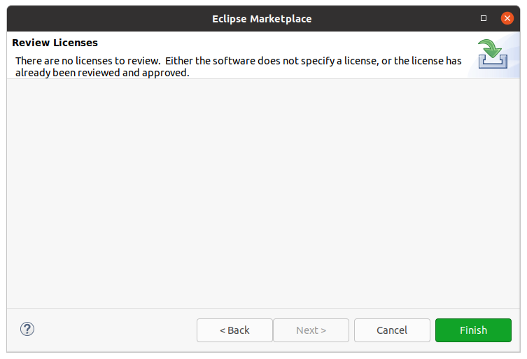


### Referencie o SceneBuilder no Eclipse

Com o Eclipse aberto, siga os seguintes passos:

- Vá para o menu e siga o seguinte caminho: *Windows -> Preferences -> JavaFX*
    - Vai aparecer a janela abaixo.

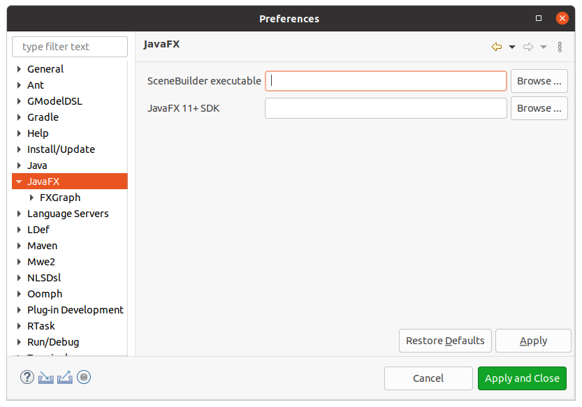

- No campo **SceneBuilder executable**, entrar o caminho completo do arquivo executável do Scene Builder. 
    - **Exemplo:** no meu sistema ubuntu, o caminho ficou assim: `/opt/scenebuilder/bin/SceneBuilder`

- Depois clique nos botões **Apply** e **Apply and Close**

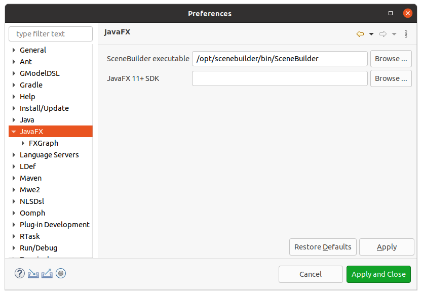


### Crie uma User Library no Eclipse com o nome de JavaFX18

Com o Eclipse aberto, siga os seguintes passos:

- Vá para o menu e siga o caminho: *Window -> Preferences -> Java -> Build Path -> User Libraries -> New*
- Dê o nome de **JavaFX18**
- Clique em *Add External Jars* (aponte para a pasta bin do JavaFX)
- Clique em **Apply and Close**

As figuras abaixo ilustram os passos descritos acima:

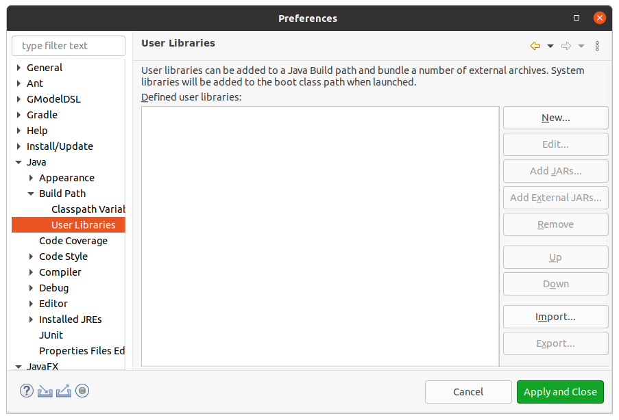

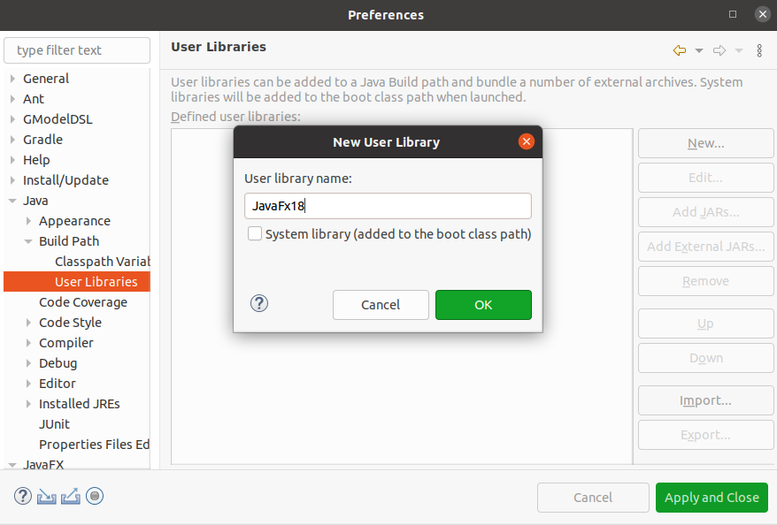

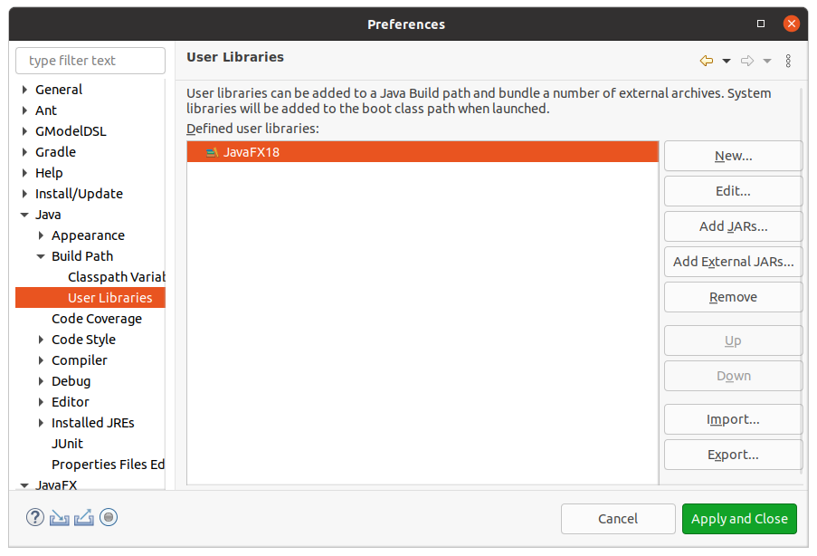

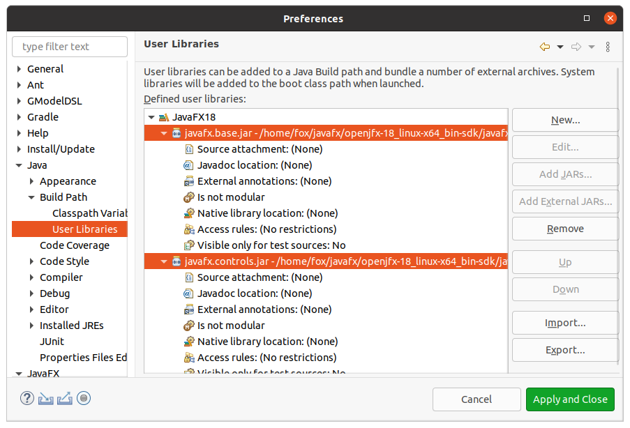


---

## 03. Criando um novo projeto JavaFX no Eclipse

**Criação do projeto:**

- *File -> New -> Other -> JavaFX Project -> Clique em Next* (Veja tela ilustrativa abaixo)
- Dê um nome ao projeto, desmarque a opção *Create module-info.java file* e, depois, clique *Next*
- Na aba *Libraries*, selecione *Modulepath*, clique em *Add Library*, selecione *User Library*, selecione a bilioteca *JavaFX18* que você criou em passos anteriores
- Clique *Finish*

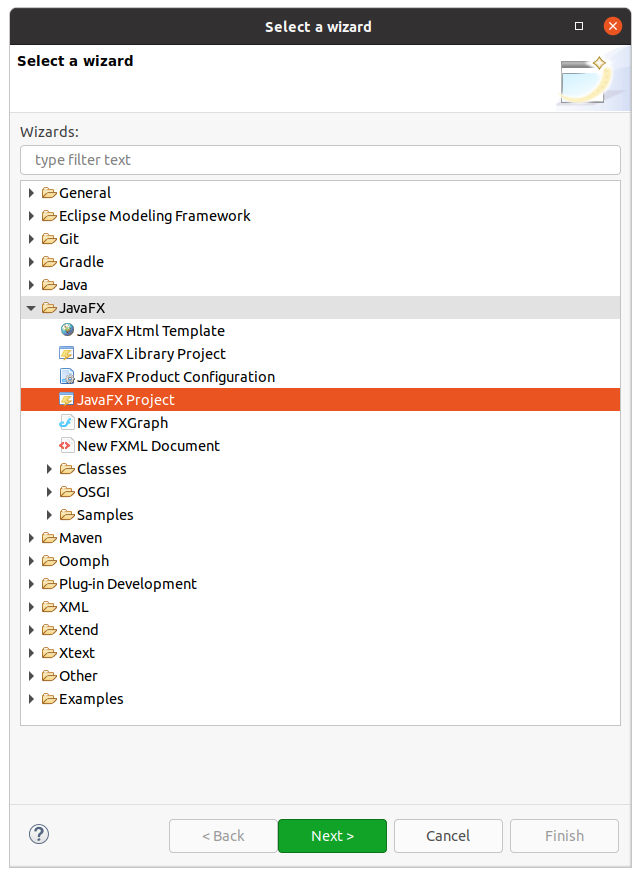

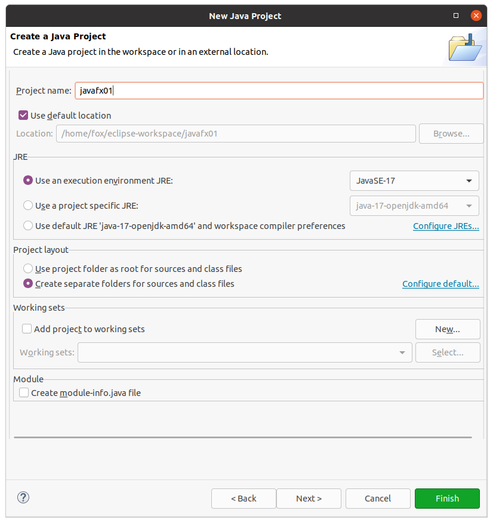

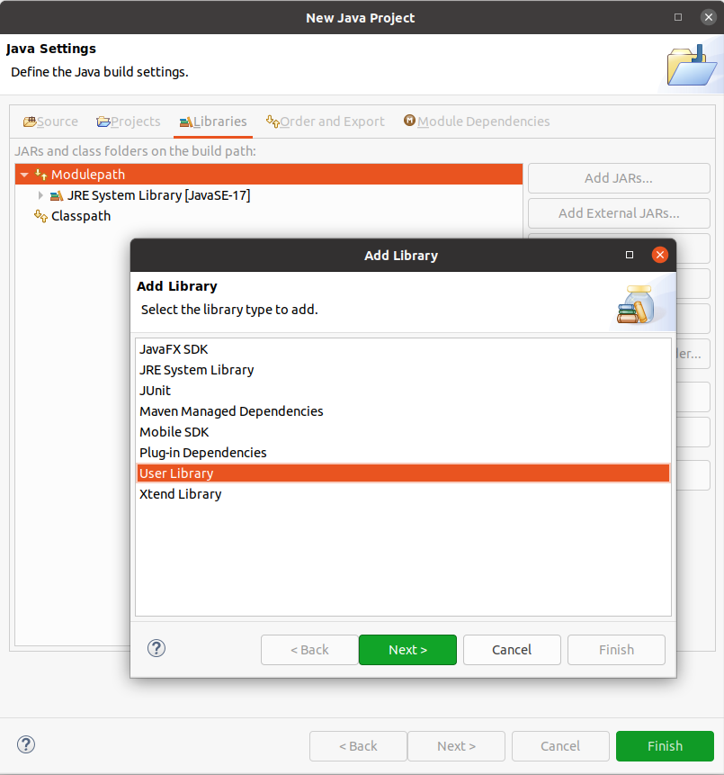

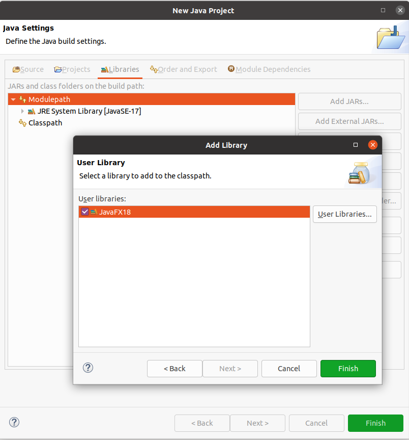

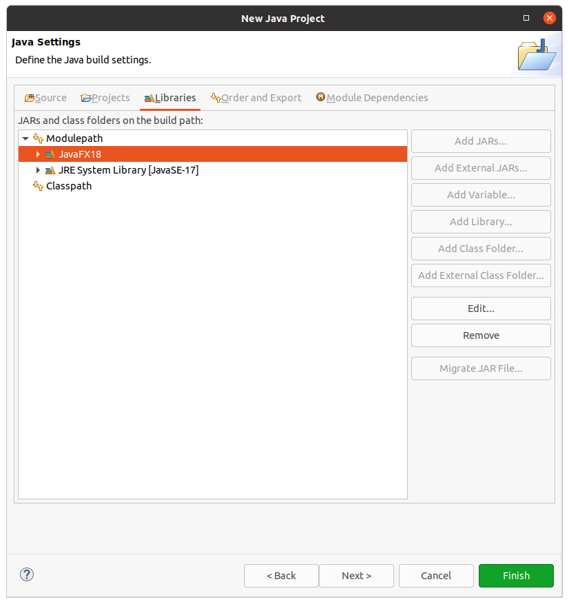


**Configuração do build:**

Para que o seu projeto seja compilado com sucesso, é preciso realizar mais uma configuração. Será preciso configurar a variável de ambiente **vmArgs**. Isso pode ser feito no Eclipse seguindo os passos abaixo.

- Botão direito no projeto -> Run As -> Run Configurations -> Selecione a aba *Arguments* -> vá para a caixa de texto *VM Arguments* (a janela que aparecerá está ilustrada na figura abaixo)
- Copiar o conteúdo abaixo na caixa de texto *VM Arguments*, adaptando a parte em negrito para o caminho da pasta *lib* na sua máquina:
    - --module-path **CAMINHO_DO_JAVAFX_LIB** --add-modules javafx.controls,javafx.base,javafx.fxml,javafx.graphics,javafx.media,javafx.web

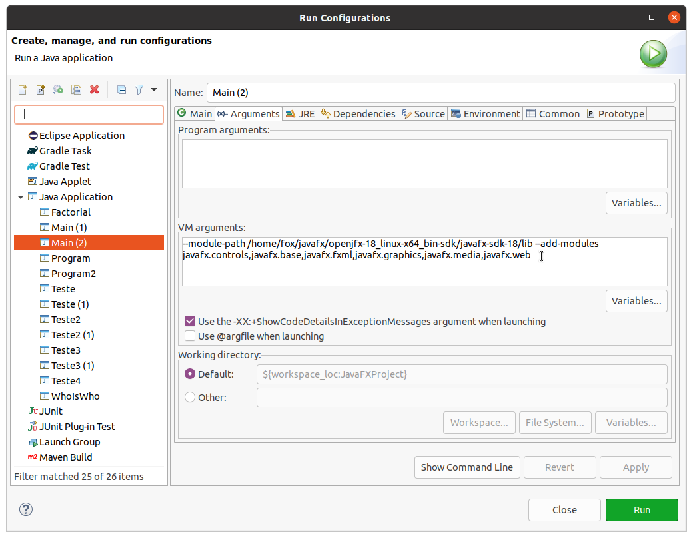

**Código da classe Main.java:**

Pronto! Neste momento, um projeto JavaFX  já foi criado no Eclipse e já está pronto para ser executado!

O projeto padrão criado pelo Eclipse já vem com uma classe *Main* padrão que cria uma tela em branco. O código da classe Main é exibido abaixo, juntamente com a tela inicial do projeto no Eclipse.

```java
package application;
	
import javafx.application.Application;
import javafx.stage.Stage;
import javafx.scene.Scene;
import javafx.scene.layout.BorderPane;


public class Main extends Application {
	@Override
	public void start(Stage primaryStage) {
		try {
			BorderPane root = new BorderPane();
			Scene scene = new Scene(root,400,400);
			scene.getStylesheets().add(getClass()
				 .getResource("application.css").toExternalForm());
			primaryStage.setScene(scene);
			primaryStage.show();
		} catch(Exception e) {
			e.printStackTrace();
		}
	}
	
	public static void main(String[] args) {
		launch(args);
	}
}
```

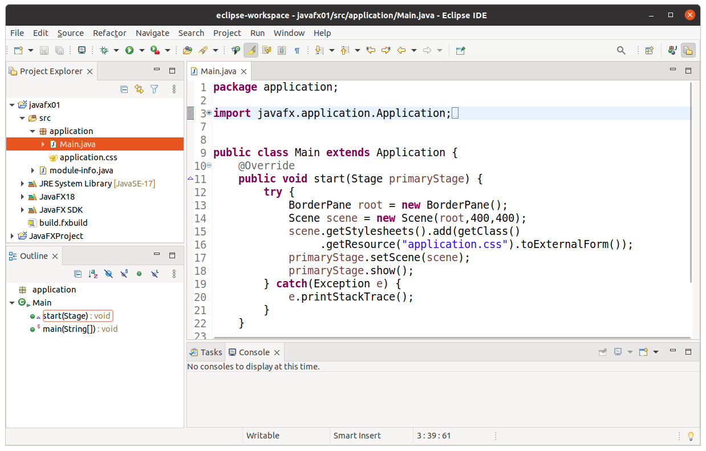


**Executando a aplicação**

- Clicar com o botão direito na classe *Main.java* -> *Run as* -> *Java Application*

A tela abaixo aparecerá.

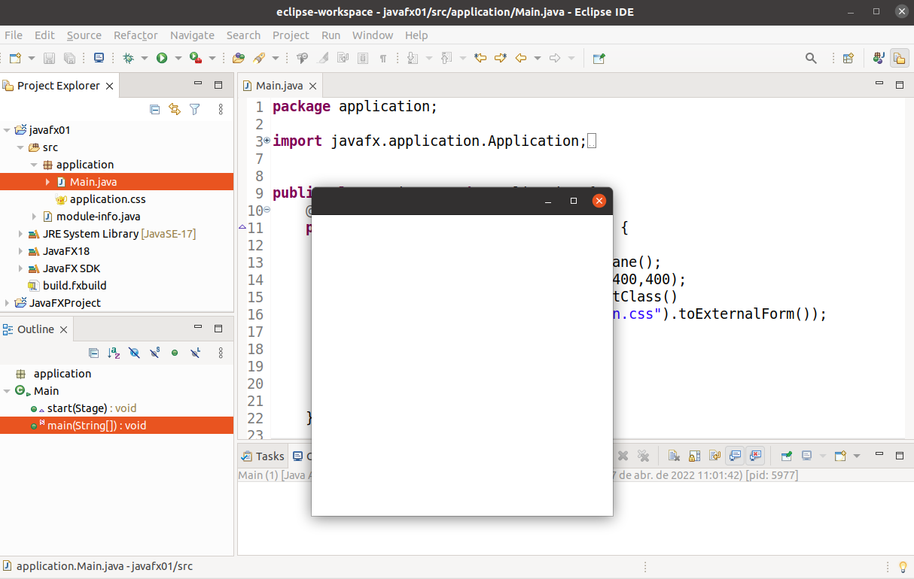